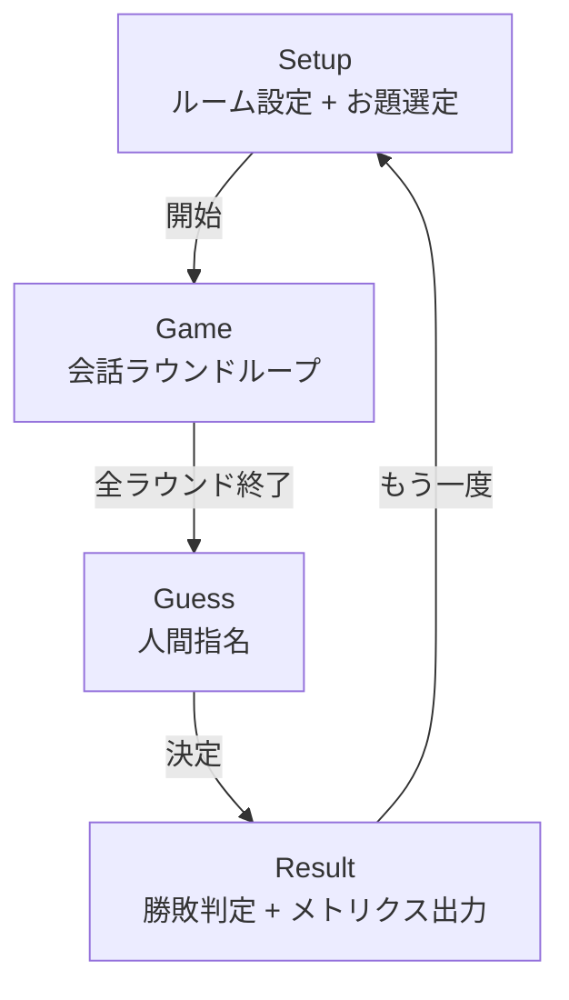
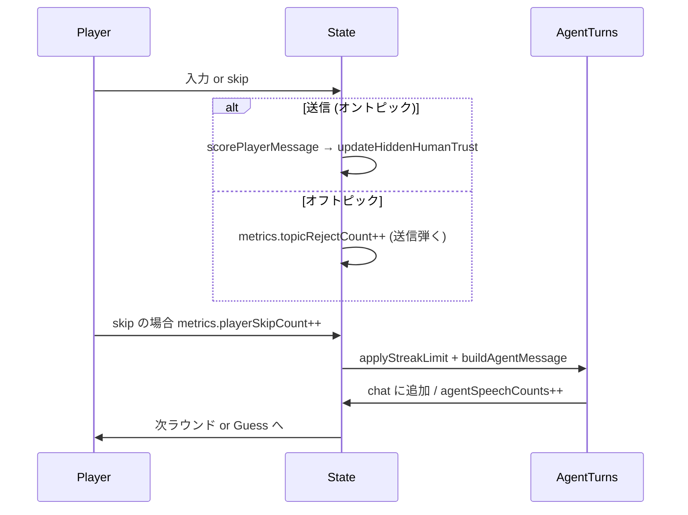
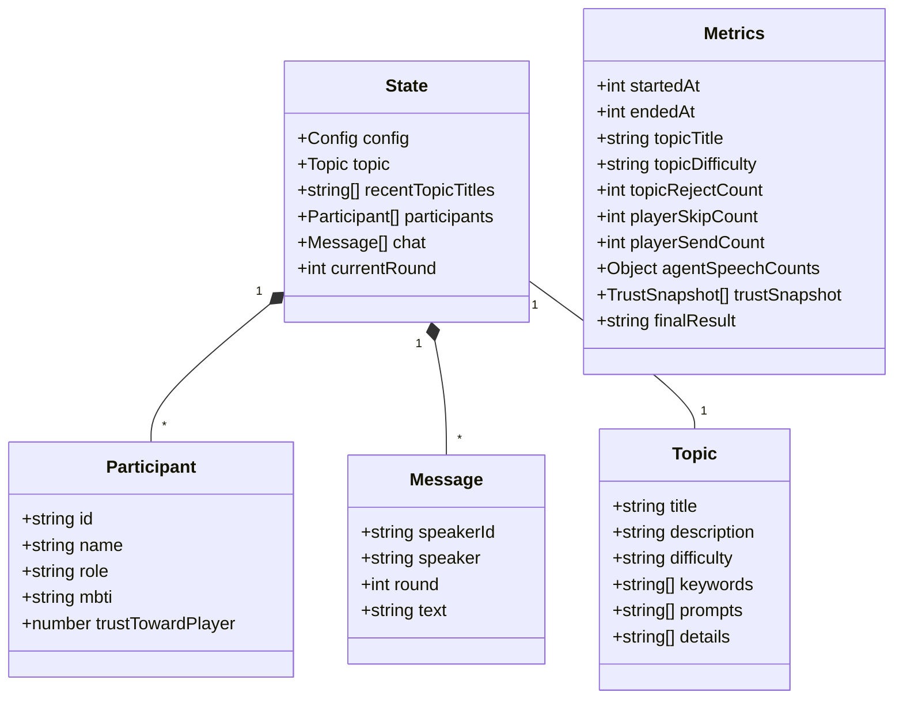

# AIwolf アーキテクチャ

現状はクライアント完結型 (静的ホスティング) の MVP。サーバ無し、永続化は localStorage のみ。

## フェーズ遷移

## ラウンド内の処理フロー

## データモデル (主要部)

## 信頼度の流れ

1. `createParticipants` 時に隠れ人間に `trustTowardPlayer` を初期化 (`HIDDEN_HUMAN_BASE_TRUST + 乱数 + MBTI bias`)
2. プレイヤー発言 → `scorePlayerMessage` で 0.12〜0.45 の gain
3. 全隠れ人間の `trustTowardPlayer` に `gain` を加算 (上限 0.98)
4. 終局時、`trustTowardPlayer >= TRUST_RECOGNITION_THRESHOLD (=0.75)` の隠れ人間が「あなたを人間と認識した」とカウントされる

## メトリクス出力

- 終局時 (`evaluateResult`) に `console.log("[AIwolf] session metrics:", metrics)` で全体出力
- 同時に `localStorage` の `aiwolf:metrics-history` に最大 50 件保持
- 取得: `JSON.parse(localStorage.getItem("aiwolf:metrics-history"))`

## 配信

- ローカル: `cd web && python3 -m http.server 8000` → `http://localhost:8000/`
- GitHub Pages: `https://seeton.github.io/AIwolf/` (`.github/workflows/pages.yml` が `main` への push でデプロイ)

## お題の重複抑止

- `state.recentTopicTitles` (直近 `TOPIC_HISTORY_LIMIT=2` 件) を保持し、`pickTopic` がそれを除外して候補プールを作る
- 候補が空 (= TOPICS が履歴で全埋まり) の場合は履歴を無視して全件から選ぶ
